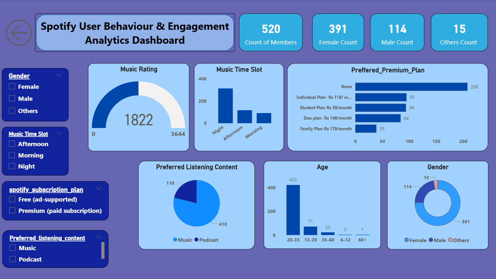

# Spotify Data Analysis

## 📌 Objective
Analyze Spotify user listening behavior and trends

## 🛠 Tools Used
- Excel
- Power BI

## 📊 Dashboard Preview

## 🔍 Key Insights
- Identified peak listening time
- Analyzed user behavior trends
- Compared subscription patterns

## 📁 Project Description
This project focuses on analyzing Spotify user data to understand listening habits and engagement.  
An interactive dashboard was created using Power BI to visualize key metrics.

This project helped me understand data visualization and user behavior analysis.
